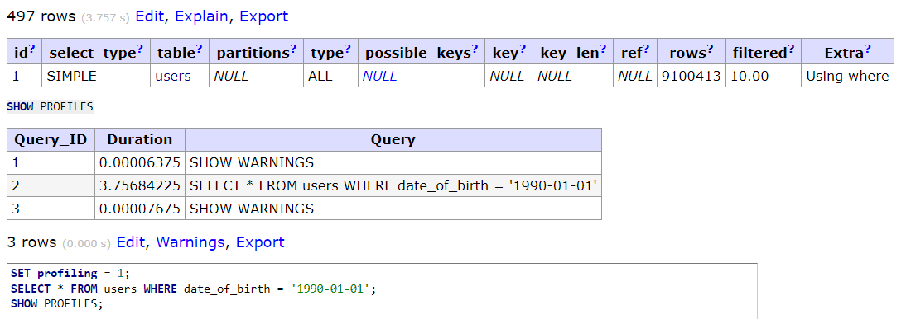
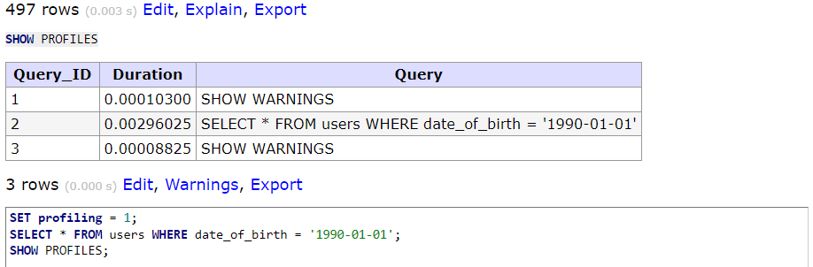
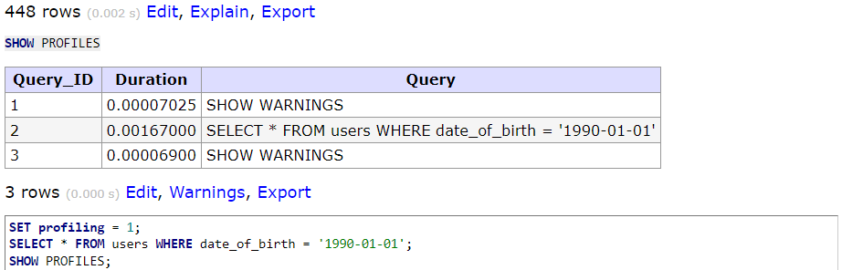
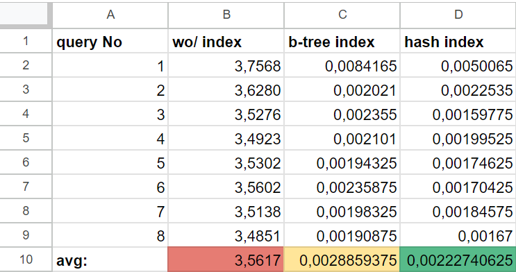

# InnoDB Index Performance Comparison

This project demonstrates the performance of InnoDB indexes in MySQL by comparing selection queries on a table with 40 million users. The focus is on the performance differences when using no index, a BTREE index, and a HASH index on the `date_of_birth` column.

## Getting Started

Follow these steps to set up and run the project:

### 1. Build the Application

```bash
./mill app.docker.build
```

This command builds the Docker image of the application using Mill.

### 2. Start Services with Docker Compose

```bash
docker compose up -d
```

This will start the required services, including the MySQL database. Give it some minutes to insert all the records.

### 3. Perform Selection Without Index

Run the following SQL commands in your MySQL client:

```sql
SET profiling = 1;
SELECT * FROM users WHERE date_of_birth = '1990-01-01';
SHOW PROFILES;
```

Screenshot of results: 

### 4. Perform Selection With BTREE Index

Create a BTREE index and then perform the selection:

```sql
CREATE INDEX idx_date_of_birth ON users(date_of_birth);

-- Run the SELECT query again
SET profiling = 1;
SELECT * FROM users WHERE date_of_birth = '1990-01-01';
SHOW PROFILES;
```

Screenshot of results: 

### 5. Perform Selection With HASH Index

First, modify your `docker-compose.yml` to include `--skip-innodb-adaptive-hash-index`. Then, create a HASH index and perform the selection:

```sql
CREATE INDEX idx_date_of_birth ON users(date_of_birth) USING HASH;

-- Run the SELECT query again
SET profiling = 1;
SELECT * FROM users WHERE date_of_birth = '1990-01-01';
SHOW PROFILES;
```

Screenshot of results: 

### Result Comparison

Compare the results of the selections under different indexing strategies:

Screenshot of comparison: 
